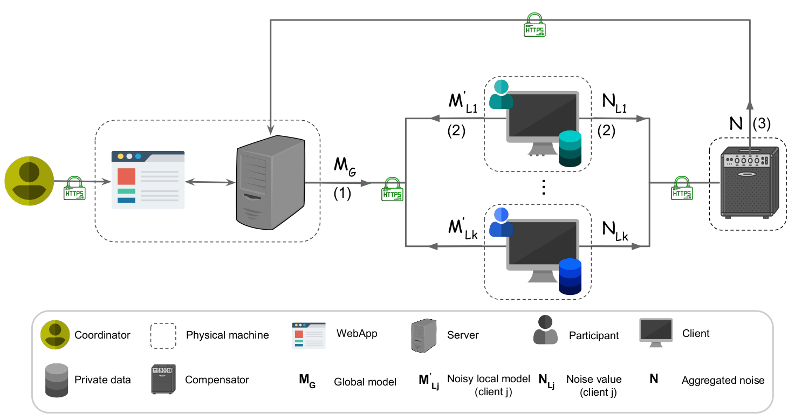

# HyFed

## __Hybrid Federated Framework for Privacy-preserving Machine Learning__

<p float="left">

   &nbsp;&nbsp;&nbsp;&nbsp;&nbsp;&nbsp;&nbsp;&nbsp;&nbsp;&nbsp;

</p>

## About
**HyFed** is a framework to develop federated, privacy-preserving machine learning algorithms. It is developed at the Technical University of Munich (TUM).
HyFed consists of four main components: 
1. **WebApp** to set up the (hyper-)parameters of the federated algorithm
2. **Client** to compute the local model and perturb it with noise 
3. **Compensator** to calculate the aggregated noise by aggregating the noise values from the clients
4. **Server** to coordinate the training process and compute the global model by adding up the noisy local models from the clients and 
   the negative of the aggregated noise from the compensator
   
<p float="left">

   
**HyFed** provides enhanced privacy while preserving the utility of the global model, i.e. it hides the original values of the local parameters
of a client from the server, compensator, or the other clients without adversely affecting the accuracy of the global model. **HyFed** supports the simulation mode, where all components
 are running in the same machine and communicate over the loopback network, and the federated mode in which the components are installed in separate machines and 
securely communicate with each other over the Internet. **HyFed** provides developers with the client and server Python API 
to implement their own federated, privacy-preserving algorithms.

To see how to **install** the **HyFed** framework, please see [HyFed-Install](hyfed-docs/readme/install_hyfed.md). <br/>
To learn how to **develop** your own federated tool using the **HyFed** API, please see [HyFed-Develop](hyfed-docs/readme/develop_hyfed.md). <br/>
To **run** the **HyFed** framework, please see [HyFed-Run](hyfed-docs/readme/run_hyfed.md). <br/>
To learn more about **HyFed**, please read the [HyFed manuscript](https://arxiv.org/abs/2105.10545).

## License
The **HyFed** source code is licensed under the Apache License Version 2.0. (C) 2021, the **HyFed** developers.

## Citation
If you use the **HyFed** framework in your study, please cite it as follows: <br />
   ```
   @misc{nasirigerdeh2021hyfed,
          title={HyFed: A Hybrid Federated Framework for Privacy-preserving Machine Learning},
          author={Reza Nasirigerdeh and Reihaneh Torkzadehmahani and Julian Matschinske and Jan Baumbach and Daniel Rueckert and Georgios Kaissis},
          year={2021},
          eprint={2105.10545},
          archivePrefix={arXiv},
          primaryClass={cs.LG}
   }
   ```
## Contact
In case of questions or problems regarding **HyFed**, please contact the **HyFed** developers: Reza Nasirigerdeh, Reihaneh Torkzadehmahani, and Julian Matschinske.

## Disclaimer

This framework is a research product and is provided as it is. We assume no liability for any user action or omission.
