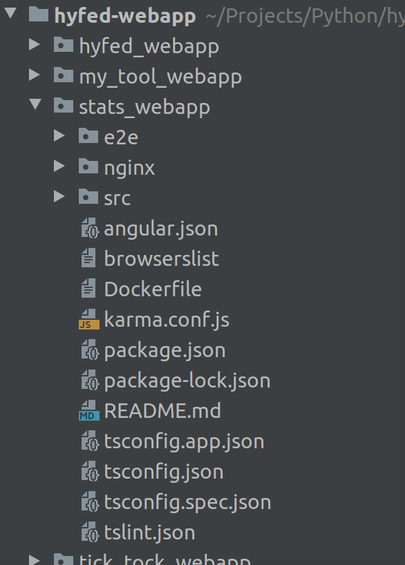
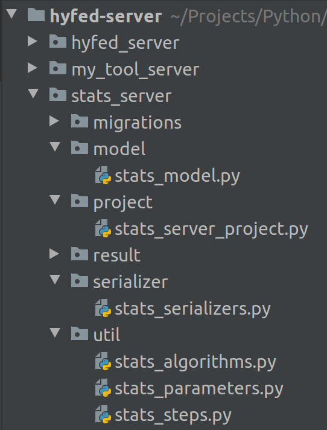
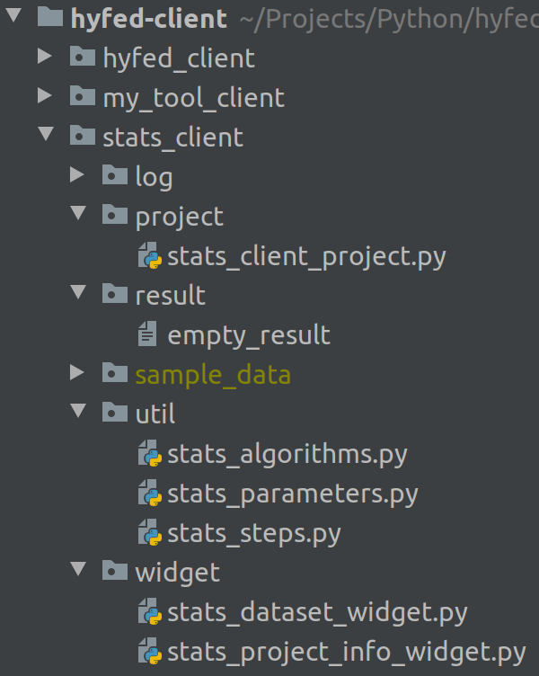

# HyFed - Develop

In this tutorial, we show how developers can implement their own federated tools using the **HyFed** framework. To this end, we develop a federated tool that 
implements variance and logistic regression (based on gradient descent) algorithms in a federated fashion using the **HyFed** API. The former algorithm is non-iterative 
while the latter is an iterative algorithm. We first choose a name for the tool and each algorithm. We employ CamelCase convention for the tool name (e.g. MyToolName or TickTock). Algorithm names are also CamelCase but with additional dash between the separate
words (e.g. My-Algorithm-Name or Tiki-Taka). We leverage **Stats** as the tool name as well as **Variance** and **Logistic-Regression** as the algorithm names. Next, 
we determine the (hyper-)parameters needed by the algorithms. Both algorithms require the list of feature names (to be used in the clients) as the project parameter. 
**Variance** needs no hyper-parameter while **Logistic-Regression** requires the **learning rate** and the maximum number of **iterations** as hyper-parameters.
The coordinator of the study (project) initializes the value of the project (hyper-)parameters during the creation of the project.

Given that, let's implement the **Stats** tool. We assume that we already installed the **HyFed** requirements outlined in [HyFed-Install](install_hyfed.md).
We start with the **WebApp** component, which implements the Web GUI of the tool. We continue with the **server** component that
implements the backend part of the tool to create projects and perform the aggregation. Next, we develop the **client** component to join the project, select the dataset,
and carry out the computation on the data. Finally, we implement the functions associated with the different steps of the algorithms on the client and server components. 
Our assumption is that the developer has basic knowledge of the Angular and HTML/CSS programming and working knowledge of Python and the Django framework.

### WebApp component

The **HyFed** WebApp component provides a simple Web GUI to signup a new account, to login/logout to/from the account, to create a new project, and to view the results. 
The **Stats** WebApp should only customize the project creation because the (hyper-)parameters of the project should be set by the coordinator to create the **Stats** projects. 
Here is the step-by-step guide to customize **WebApp** for the **Stats** tool:

1.  Go to the ***hyfed-webapp*** directory and create the WebApp directory tree for the ***Stats*** tool (**stats_webapp**):

    ```
    cd hyfed-webapp
    chmod 755 create-webapp.sh
    ./create-webapp.sh stats
    ```
    
   
2. Add the tool and algorithm names to the custom types (i.e. **ToolType** and **AlgorithmType**) 
defined in the project model file. Moreover, add the (hyper-)parameter related attributes to the ***ProjectJson*** interface and the **ProjectModel** class (in the **stats_webapp/src/app/models/project.model.ts** file):

    ```
    // stats_webapp/src/app/models/project.model.ts
   
    import {BaseModel, IModelJson} from './base.model';
    
    type ToolType = 'Select' | 'Stats'; // ADD THE TOOL NAME(S) HERE
    type AlgorithmType = 'Select' | 'Variance' | 'Logistic-Regression'; // ADD THE ALGORITHM NAME(S) HERE
    
    type StatusType = 'Created' | 'Parameters Ready' | 'Waiting for Compensator' | 'Aggregating' | 'Done' | 'Aborted' | 'Failed';
     
    export interface ProjectJson extends IModelJson {
    
      // THE CODE SECTION AFTER THE ABOVE LINE IS NOT SHOWN BECAUSE OF THE SPACE LIMITATION 

      // THE CODE SECTION BEFORE THE FOLLOWING LINE IS NOT SHOWN BECAUSE OF THE SPACE LIMITATION 

      // BEGIN Stats TOOL SPECIFIC ATTRIBUTES
      features?: string;
      learning_rate?: number;
      max_iterations?: number;
      // END Stats TOOL SPECIFIC ATTRIBUTES
    
    }
   
    export class ProjectModel extends BaseModel<ProjectJson> {
    
      // THE CODE SECTION AFTER THE ABOVE LINE IS NOT SHOWN BECAUSE OF THE SPACE LIMITATION 

      // THE CODE SECTION BEFORE THE FOLLOWING LINE IS NOT SHOWN BECAUSE OF THE SPACE LIMITATION 
    
      // BEGIN Stats TOOL SPECIFIC ATTRIBUTES
      private _features: string;
      private _learningRate: number;
      private _maxIterations: number;
      // END Stats TOOL SPECIFIC ATTRIBUTES
    
      constructor() {
        super();
      }
    
      public async refresh(proj: ProjectJson) {
   
        // THE CODE SECTION AFTER THE ABOVE LINE IS NOT SHOWN BECAUSE OF THE SPACE LIMITATION 

        // THE CODE SECTION BEFORE THE FOLLOWING LINE IS NOT SHOWN BECAUSE OF THE SPACE LIMITATION 
    
        // BEGIN Stats TOOL SPECIFIC ATTRIBUTES
        this._features = proj.features
        this._learningRate = proj.learning_rate
        this._maxIterations = proj.max_iterations
        // END Stats TOOL SPECIFIC ATTRIBUTES
    
      }
   
      // THE CODE SECTION AFTER THE ABOVE LINE IS NOT SHOWN BECAUSE OF THE SPACE LIMITATION 

      // THE CODE SECTION BEFORE THE FOLLOWING LINE IS NOT SHOWN BECAUSE OF THE SPACE LIMITATION 
    
      // BEGIN Stats TOOL SPECIFIC ATTRIBUTES
      public get features(): string {
        return this._features
      }
    
      public get learningRate(): number {
        return this._learningRate;
      }
    
      public get maxIterations(): number {
        return this._maxIterations;
      }
      // END Stats TOOL SPECIFIC ATTRIBUTES
    
    }
    
    ```
    Notice the attribute names associated with the hyper-parameters in the interface and class objects (e.g. learning_rate vs. learningRate).

3. The required input elements to select the tool and algorithm and to set the (hyper-)parameter values should be added to the corresponding HTML pages. 
To this end, add the following HTML code segments to the
 **stats_webapp/src/app/pages/projects-page/projects-page.component.html** file:
   ```
    <!-- stats_webapp/src/app/pages/projects-page/projects-page.component.html -->
    
    <!-- THE CODE SECTION AFTER THE ABOVE LINE IS NOT SHOWN BECAUSE OF THE SPACE LIMITATION -->

    <!-- THE CODE SECTION BEFORE THE FOLLOWING LINE IS NOT SHOWN BECAUSE OF THE SPACE LIMITATION -->

    <!-- Create project panel -->
    <div class="container is-fluid">
      <section class="section">
        <div class="card">
          <div class="card-content">
            <div class="content">
                <h3>Project</h3>
    
                <p class="help">
                    The creator of the project will be the <b>coordinator</b>.
                </p>
   
                <!-- Part I: Tool selection menu -->
                
                <!-- BEGIN Stats SPECIFIC TOOL SELECTION MENU -->
                <div class="field">
                    <label class="label" for="npTool">Tool </label>
                    <div class="select">
                      <select class="input" [(ngModel)]="newProject.tool" id="npTool">
                        <option value="Select">Select</option>
                        <option value="Stats">Stats</option>
                      </select>
                    </div>
                </div>
                <!-- END Stats SPECIFIC TOOL SELECTION MENU -->
                
                <!-- Part II: Algorithm selection menu -->
   
                <!-- BEGIN Stats SPECIFIC ALGORITHM SELECTION MENU -->
                <div class="field" *ngIf="newProject.tool === 'Stats'">
                    <label class="label" for="npStatsAlgorithm">Algorithm</label>
                    <div class="select">
                        <select class="input" [(ngModel)]="newProject.algorithm" id="npStatsAlgorithm">
                          <option value="Select">Select</option>
                          <option value="Variance">Variance</option>
                          <option value="Logistic-Regression">Logistic-Regression</option>
                        </select>
                    </div>
                </div>
                <!-- END Stats SPECIFIC ALGORITHM SELECTION MENU -->
   
                <!-- Part III: Name and Description textbox -->
   
                <!-- BEGIN Stats SPECIFIC Name AND Description FIELDS -->
                <div class="field" *ngIf="newProject.tool === 'Stats' && newProject.algorithm !== 'Select'">
                    <label class="label" for="npName">Name</label>
                    <div class="control" style="width:30%">
                        <input class="input" [(ngModel)]="newProject.name" id="npName" placeholder="Name of the project" />
                    </div>
                </div>
                
                <div class="field" *ngIf="newProject.tool === 'Stats' && newProject.algorithm !== 'Select'">
                  <label class="label" for="npDescription">Description</label>
                  <div class="control" style="width:70%">
                    <input class="input" [(ngModel)]="newProject.description" id="npDescription" placeholder="Description of the project" />
                  </div>
                </div>
                <!-- END Stats SPECIFIC Name AND Description FIELDS -->
   
                <!-- Part IV: features, learning rate, and max iterations textbox -->

                <!-- BEGIN Stats SPECIFIC (HYPER-)PARAMETER INPUTS -->
                <div class="field" *ngIf="newProject.tool === 'Stats' && newProject.algorithm !== 'Select'">
                    <label class="label" for="npFeatures">Features</label>
                    <div class="control" style="width:40%">
                        <input class="input" [(ngModel)]="newProject.features" id="npFeatures" placeholder="Comma-separated list of features (e.g. Age,BloodPressure)" />
                    </div>
                </div>
                <div class="field" *ngIf="newProject.tool === 'Stats' && newProject.algorithm === 'Logistic-Regression'">
                    <label class="label" for="npLearningRate">Learning rate</label>
                    <div class="control" style="width:30%">
                      <input class="input" [(ngModel)]="newProject.learning_rate" id="npLearningRate" placeholder=" Float number (e.g. 0.1)" />
                    </div>
                </div>
                
                <div class="field" *ngIf="newProject.tool === 'Stats' && newProject.algorithm === 'Logistic-Regression'">
                    <label class="label" for="npMaxIterations">Max iterations</label>
                    <div class="control" style="width:30%">
                      <input class="input" [(ngModel)]="newProject.max_iterations" id="npMaxIterations" placeholder="Integer (e.g. 150)" />
                    </div>
                </div>
                <!-- END Stats SPECIFIC (HYPER-)PARAMETER INPUTS -->

                <!-- Part V: Keep 'Create' button disabled until all inputs are provided -->

                <!-- BEGIN Stats SPECIFIC DISABLE/ENABLE Create BUTTON -->
                <div class="field">
                <div class="control">
                  <div class="buttons">
                    <button class="button is-success" [disabled]="newProject.tool === 'Select' || newProject.algorithm === 'Select' ||
                                                                  !newProject.name || !newProject.description || !newProject.features ||
                                                                  (newProject.algorithm === 'Logistic-Regression' && (!newProject.learning_rate || !newProject.max_iterations))"
                            (click)="createProject()">
                      <i class="fa fa-plus icon"></i>
                      <span>Create</span>
                    </button>
                  </div>
                </div>
                </div>
                <!-- END Stats SPECIFIC DISABLE/ENABLE Create BUTTON -->
   
    <!-- THE CODE SECTION AT THE END OF THE FILE IS NOT SHOWN BECAUSE OF THE SPACE LIMITATION -->
   ```

4. The (hyper-)parameter associated attributes should be added to the project summary page. Therefore, add the following to
**stats_webapp/src/app/pages/project-page/project-page.component.html**:
    ```
    <!-- stats_webapp/src/app/pages/project-page/project-page.component.html -->
   
    <!-- THE CODE SECTION AT THE BEGINNING OF THE FILE IS NOT SHOWN BECAUSE OF THE SPACE LIMITATION -->
    

    <!-- BEGIN Stats SPECIFIC (HYPER-)PARAMETER VALUES -->
    <p *ngIf="project.tool == 'Stats'">
      <b>Features:</b> {{project.features}}
    </p>

    <p *ngIf="project.tool == 'Stats' && project.algorithm == 'Logistic-Regression'">
      <b>Learning rate:</b> {{project.learningRate}}
    </p>

    <p *ngIf="project.tool == 'Stats' && project.algorithm == 'Logistic-Regression'">
      <b>Max iterations:</b> {{project.maxIterations}}
    </p>
    <!-- END Stats SPECIFIC (HYPER-)PARAMETER VALUES -->
   
    <!-- THE CODE SECTION AT THE END OF THE FILE IS NOT SHOWN BECAUSE OF THE SPACE LIMITATION -->
   
    ```
   
5. Update the index page (**stats_webapp/src/app/pages/index-page/index-page.component.html**),
 'How to' page (**stats_webapp/src/app/pages/how-to-page/how-to-page.component.html**) and 
 'About' page (**stats_webapp/src/app/pages/about-page/about-page.component.html**) too. At this point, we are done with the WebApp component of the **Stats** tool.

### Server component
The **HyFed** server component handles the backend functions for account signup/login/logout, project creation, client coordination, and model aggregation.
The **Stats** server component should customize the project creation and model aggregation functionalities. In this section, we cover the project creation for the **Stats** tool.
In the last section, we will implement the **Stats** aggregation operation for the **Variance** and **Logistic-Regression** algorithms. Here is the step-by-step guide to 
customize the project creation for the **Stats** server component:

1. Go to the **hyfed-server** directory and create the server project directory tree for the **Stats** tool (**stats_server**):
    
   ```
    cd hyfed-server
    chmod 755 create-server-project.sh
    ./create-server-project.sh stats
   ```
    
   
2. Define a new Django model to store the project parameters specified by the coordinator (and sent from the WebApp to the server). **HyFedProjectModel** 
stores the basic project parameters such as tool name, algorithm name, project name, project description, etc. Therefore, the new Django model, **StatsProjectModel**, inherits from
the **HyFedProjectModel** class and adds the **Stats** specific model fields (for features, learning rate, and max iterations) to the class. 
We define **StatsProjectModel** in **stats_server/model/stats_model.py** as follows:
    ```
    # stats_server/model/stats_model.py
   
    from django.db import models
    from hyfed_server.model.hyfed_models import HyFedProjectModel
    
    
    class StatsProjectModel(HyFedProjectModel):
        """
            The model inherits from HyFedProjectModel
            so it implicitly has id, name, status, etc, fields defined in the parent model
        """
   
        features = models.CharField(max_length=512, default="")
        learning_rate = models.FloatField(default=0.1)
        max_iterations = models.PositiveIntegerField(default=150)
    ```
   
    Notice that the field names, features, learning_rate and max_iterations, should be the same as those defined in **ProjectJson**
    interface of the WebApp (**stats_webapp/src/app/models/project.model.ts**). 

3. Define a project serializer to serialize the **Stats** projects. The **HyFedProjectSerializer** class 
serializes the basic project parameters, and therefore, the new serializer class, **StatsProjectSerializer**, inherits from the **HyFedProjectSerializer**.
We define **StatsProjectSerializer** in **stats_server/serializer/stats_serializers.py** as follows:

    ```
    # stats_server/serializer/stats_serializers.py
   
    from rest_framework import serializers
    from hyfed_server.serializer.hyfed_serializers import HyFedProjectSerializer
    
    
    class StatsProjectSerializer(HyFedProjectSerializer):
        """ Serializes the Stats project model to serve a WebApp/client request """
    
        features = serializers.SerializerMethodField()
        learning_rate = serializers.SerializerMethodField()
        max_iterations = serializers.SerializerMethodField()
   
        def get_features(self, instance):
            return instance.features
    
        def get_learning_rate(self, instance):
            return instance.learning_rate
    
        def get_max_iterations(self, instance):
            return instance.max_iterations
    
        class Meta(HyFedProjectSerializer.Meta):
            fields = HyFedProjectSerializer.Meta.fields + ('features', 'learning_rate', 'max_iterations',)
    ```

4. Define the **Stats** specific project parameter and algorithm name constants. The aim of these constants is to avoid using hard-coded
values (i.e. 'learning_rate' or 'Logistic-Regression'') in the code. The value of these constants should be the same as the field names
in **StatsProjectModel**. We define the **StatsProjectParameter** and **StatsAlgorithm** classes in the **stats_server/util/stats_parameters.py** and  **stats_server/util/stats_algorithms.py**, respectively:
    ```
    # stats_server/util/stats_parameters.py
   
    class StatsProjectParameter:
        FEATURES = "features"
        LEARNING_RATE = "learning_rate"
        MAX_ITERATIONS = "max_iterations"

    class StatsLocalParameter:
    """ Name of the local (client -> server) parameters """

    SAMPLE_COUNT = "local_sample_count"  # variance and logistic regression algorithms
    SUM = "local_sum"  # variance algorithm
    SSE = "local_sse"  # variance algorithm
    BETA = "local_beta"  # logistic regression algorithm


    class StatsGlobalParameter:
    """ Name of the global (server -> client) parameters """

    MEAN = "global_mean"  # variance algorithm
    BETA = "global_beta"  # logistic regression algorithm
    ```
   
    ```
    # stats_server/util/stats_algorithms.py
    
    class StatsAlgorithm:
        VARIANCE = "Variance"
        LOGISTIC_REGRESSION = "Logistic-Regression"
    ```

5. Define a **Stats** specific server project class, **StatsServerProject**, to initialize **Stats** projects and
perform aggregation in the different steps of the **Stats** algorithms (i.e. variance and logistic regression).
**HyFedServerProject** is the base class that provides project initialization, client coordination, pre-aggregation, and post-aggregation operations.
Therefore, we define **StatsServerProject** inheriting from **HyFedServerProject** in the **stats_server/project/stats_server_project.py** file:
    
    ```
    # stats_server/project/stats_server_project.py
   
    from hyfed_server.project.hyfed_server_project import HyFedServerProject
    from hyfed_server.util.hyfed_steps import HyFedProjectStep
    from hyfed_server.util.status import ProjectStatus
    from hyfed_server.util.utils import client_parameters_to_list

    from stats_server.util.stats_steps import StatsProjectStep
    from stats_server.util.stats_parameters import StatsGlobalParameter, StatsLocalParameter, StatsProjectParameter
    from stats_server.util.stats_algorithms import StatsAlgorithm

    import numpy as np
    
    import logging
    logger = logging.getLogger(__name__)
    
    
    class StatsServerProject(HyFedServerProject):
        """ Server side of Stats project """

    def __init__(self, creation_request, project_model):
        """ Initialize Stats project attributes based on the values set by the coordinator """

        # initialize base project
        super().__init__(creation_request, project_model)

        try:
            # save project (hyper-)parameters in the project model and initialize the project
            stats_model_instance = project_model.objects.get(id=self.project_id)

            # features
            features = creation_request.data[StatsProjectParameter.FEATURES]
            stats_model_instance.features = features
            self.features = [feature.strip() for feature in features.split(',')]

            # learning rate and max iterations if algorithm is logistic regression
            if self.algorithm == StatsAlgorithm.LOGISTIC_REGRESSION:
                # learning rate
                learning_rate = float(creation_request.data[StatsProjectParameter.LEARNING_RATE])
                stats_model_instance.learning_rate = learning_rate
                self.learning_rate = learning_rate

                # max iterations
                max_iterations = int(creation_request.data[StatsProjectParameter.MAX_ITERATIONS])
                stats_model_instance.max_iterations = max_iterations
                self.max_iterations = max_iterations

            # result directory
            result_dir = "stats_server/result"
            stats_model_instance.result_dir = result_dir
            self.result_dir = result_dir

            # save the model
            stats_model_instance.save()
            logger.debug(f"Project {self.project_id}: Stats specific attributes initialized!")

            # used to keep track the iteration number in the logistic regression algorithm
            self.current_iteration = 1

            # global attributes
            self.global_sample_count = 0
            self.global_mean = 0.0
            self.global_variance = 0.0
            self.global_beta = []

        except Exception as model_exp:
            logger.error(model_exp)
            self.project_failed()
    ```
 
    As you might notice we have two copies of the project parameters: one in the model (database) and the other in the server
    project itself (memory). The copy in the database is only used to serve the WebApp requests to show the project information in the frontend. 
    The copy in the memory is used when the project is running to speed up the computation at the server side 
    (by avoiding connecting to the database for every request from the client).
 
6. Add the mapper classes for the **Stats** tool to the **hyfed_server/mappers.py** file as follows:
    ```
    # hyfed_server/mappers.py
   
    #  THE CODE SECTION AT THE BEGINNING OF THE FILE IS NOT SHOWN BECAUSE OF THE SPACE LIMITATION 
   
    from stats_server.project.stats_server_project import StatsServerProject
    from stats_server.model.stats_model import StatsProjectModel
    from stats_server.serializer.stats_serializers import StatsProjectSerializer
    
    # server_project, project_model, and project_serializer are mappers used in webapp_view
    server_project = dict()
    project_model = dict()
    project_serializer = dict()
   
    # Stats tool mapper classes
    stats_tool_name = 'Stats'
    server_project[stats_tool_name] = StatsServerProject
    project_model[stats_tool_name] = StatsProjectModel
    project_serializer[stats_tool_name] = StatsProjectSerializer
   
    #  THE CODE SECTION AT THE END OF THE FILE IS NOT SHOWN BECAUSE OF THE SPACE LIMITATION 
    ```
   
7. Add the **stats_server** to the INSTALLED_APPS of the Django in **hyfed_server/settings.py** file:
    ```
    # hyfed_server/settings.py
   
    #  THE CODE SECTION AT THE BEGINNING OF THE FILE IS NOT SHOWN BECAUSE OF THE SPACE LIMITATION 
   
    INSTALLED_APPS = [
        'django.contrib.admin',
        'django.contrib.auth',
        'django.contrib.contenttypes',
        'django.contrib.sessions',
        'django.contrib.messages',
        'django.contrib.staticfiles',
    
        'rest_framework',
        'rest_framework_simplejwt.token_blacklist',
        'corsheaders',
        'hyfed_server',  # HyFed server app
   
        'my_tool_server',  # MyTool server app
    
        'stats_server',  # Stats server app
    ]
   
    #  THE CODE SECTION AT THE END OF THE FILE IS NOT SHOWN BECAUSE OF THE SPACE LIMITATION 

    ```

Up to this point, we have implemented the logic to create **Stats** projects. In the last section of the tutorial, we will implement the aggregation operation in
different steps of the variance and logistic regression algorithms. For now, we continue with the **Client** component.

### Client component 
The **HyFed** client component provides a simple GUI to join the project, show the project parameters/info, select dataset file(s), and show the status/progress of the project.
It also computes the local model parameters from the dataset and provides core functions to exchange the parameters (including global/local model parameters) with the server over the network.
The **Stats** client component should customize the widgets for displaying the project parameters and dataset selection as well as functions to compute the 
(local) model parameters in different steps of the algorithms (i.e. variance and logistic regression). In this section, we show how to customize 
 the widgets for the **Stats** tool. We cover the functions for calculating model parameters in the last section.

1. Go to the **hyfed-client** directory and create the client project directory structure for the **Stats** tool (**stats_client**):
   ```
    cd hyfed-client
    chmod 755 create-client-project.sh
    ./create-client-project.sh stats
   ```
    

2. Similar to the project parameter and algorithm name constants in the server component, define the **Stats** project parameter and algorithm constants in the
**stats_client/util/stats_parameters.py** and **stats_client/util/stats_algorithms.py** files, respectively. Notice that constant values in the client and server components must be the same.
    ```
    # stats_client/util/stats_parameters.py
   
    class StatsProjectParameter:
        FEATURES = "features"
        LEARNING_RATE = "learning_rate"
        MAX_ITERATIONS = "max_iterations"
    ```
   
    ```
    # stats_client/util/stats_algorithms.py
    
    class StatsAlgorithm:
        VARIANCE = "Variance"
        LOGISTIC_REGRESSION = "Logistic-Regression"
    ```
   
3. Define the project info widget for the **Stats** tool, **StatsProjectInfoWidget**, by inheriting from
the **HyFedProjectInfoWidget** class. **StatsProjectInfoWidget** displays the **Stats** specific (hyper-)project parameters on the 
widget (features, learning rate, and max iterations) and is defined in the **stats_client/widget/stats_project_info_widget.py** file.
    ```
    # stats_client/widget/stats_project_info_widget.py
   
    from hyfed_client.widget.hyfed_project_info_widget import HyFedProjectInfoWidget
    from hyfed_client.util.gui import add_label_and_textbox
    from hyfed_client.util.hyfed_parameters import HyFedProjectParameter
    from stats_client.util.stats_parameters import StatsProjectParameter
    from stats_client.util.stats_algorithms import StatsAlgorithm


    class StatsProjectInfoWidget(HyFedProjectInfoWidget):
        def __init__(self, title, connection_parameters, authentication_parameters):

        super().__init__(title=title, connection_parameters=connection_parameters,
                         authentication_parameters=authentication_parameters)

    # Stats project specific info
    def add_stats_project_info(self):
        add_label_and_textbox(self, label_text="Features",
                              value=self.project_parameters[StatsProjectParameter.FEATURES], status='disabled')

        if self.project_parameters[HyFedProjectParameter.ALGORITHM] == StatsAlgorithm.LOGISTIC_REGRESSION:
            add_label_and_textbox(self, label_text="Learning rate",
                                  value=self.project_parameters[StatsProjectParameter.LEARNING_RATE], status='disabled')

            add_label_and_textbox(self, label_text="Max iterations",
                                  value=self.project_parameters[StatsProjectParameter.MAX_ITERATIONS], status='disabled')
    ```
 
4. Define the **Stats** dataset widget, **StatsDatasetWidget**, in the **stats_client/widget/stats_dataset_widget.py** file 
by inheriting from the **HyFedDatasetWidget** class. This widget enables the participants to select the **CSV** file containing the
data to compute the local model parameters.

    ```
    # stats_client/widget/stats_dataset_widget.py
   
    from hyfed_client.widget.hyfed_dataset_widget import HyFedDatasetWidget
    from hyfed_client.util.gui import add_label_and_textbox, add_button, select_file_path
    
    
    class StatsDatasetWidget(HyFedDatasetWidget):
        """ This widget enables users to add the file/directory dialogs and select dataset files/directories """

    def __init__(self, title):

        super().__init__(title=title)
        
        self.dataset_file_path_entry = add_label_and_textbox(widget=self, label_text='Dataset File', increment_row_number=False)
        
        self.dataset_file_path = ''  # initialized in set_dataset_file_path function

        add_button(widget=self, button_label="Browse", column_number=2, increment_row_number=True,
                   on_click_function=self.set_dataset_file_path)

    def set_dataset_file_path(self):
        self.dataset_file_path = select_file_path(self.dataset_file_path_entry, file_types=[('CSV files', '*.csv')])

    def get_dataset_file_path(self):
        return self.dataset_file_path

    ```
   
5. Define the **Stats** client project, **StatsClientProject**, inheriting from **HyFedClientProject** in the 
**stats_client/project/stats_client_project.py** file. The **StatsClientProject** implements the logic to open and pre-process the 
dataset file as well as computing model parameters in different steps of the algorithms (will be covered in the last section).
    ```
    # stats_client/project/stats_client_project.py
   
    from hyfed_client.project.hyfed_client_project import HyFedClientProject
    from hyfed_client.util.hyfed_steps import HyFedProjectStep
    
    from stats_client.util.stats_steps import StatsProjectStep
    from stats_client.util.stats_parameters import StatsGlobalParameter, StatsLocalParameter
    from stats_client.util.stats_algorithms import StatsAlgorithm
    
    import numpy as np
    import pandas as pd
    
    
    class StatsClientProject(HyFedClientProject):
        """
            A class that provides the computation functions to compute local parameters
        """
    
        def __init__(self, username, token, project_id, server_url, compensator_url,
                     tool, algorithm, name, description, coordinator, result_dir, log_dir,
                     stats_dataset_file_path, features, learning_rate, max_iterations):  # Stats specific arguments
    
            super().__init__(username=username, token=token, project_id=project_id, server_url=server_url,
                             compensator_url=compensator_url, tool=tool, algorithm=algorithm, name=name, description=description,
                             coordinator=coordinator, result_dir=result_dir, log_dir=log_dir)
    
            # Stats specific project attributes
            self.features = [feature.strip() for feature in features.split(',')]
            self.learning_rate = learning_rate
            self.max_iterations = max_iterations
    
            # Stats specific dataset related attributes
            self.stats_dataset_file_path = stats_dataset_file_path
            self.x_matrix = np.array([])  # re-initialized in the init_step function
            self.y_vector = np.array([])  # re-initialized in the init_step function
   
    # THE CODE SECTION AFTER THE ABOVE LINE IS NOT SHOWN BECAUSE OF THE SPACE LIMITATION 
    ```
   
6. Create the client GUI for the **Stats** tool in the **hyfed-client/stats_client_gui.py** file. The **Stats** client GUI first 
creates the join widget to allow for joining the project. If the participant joins the project successfully, it closes the join widget first, and then, creates 
the project info widget to display the project info/parameters to the participant. If the participant agrees to proceed with the project, 
the GUI destroys the project info widget and opens the dataset widget to select the dataset file. After choosing the dataset file, the GUI 
initializes an instance of the client project, closes dataset widget, and opens the project status widget to show the status and progress of the project.
Here is the complete code for the **Stats** client GUI:

    ```
    # hyfed-client/stats_client_gui.py
    
    from hyfed_client.widget.join_widget import JoinWidget
    from hyfed_client.widget.hyfed_project_status_widget import HyFedProjectStatusWidget
    from hyfed_client.util.hyfed_parameters import HyFedProjectParameter, ConnectionParameter, AuthenticationParameter
    
    from stats_client.widget.stats_project_info_widget import StatsProjectInfoWidget
    from stats_client.widget.stats_dataset_widget import StatsDatasetWidget
    from stats_client.project.stats_client_project import StatsClientProject
    from stats_client.util.stats_parameters import StatsProjectParameter
    
    import threading
    
    import logging
    logger = logging.getLogger(__name__)
    
    
    class StatsClientGUI:
        """ Stats Client GUI """
    
        def __init__(self):
    
            # create the join widget
            self.join_widget = JoinWidget(title="Stats Client",
                                          local_server_name="Localhost",
                                          local_server_url="http://localhost:8000",
                                          local_compensator_name="Localhost",
                                          local_compensator_url="http://localhost:8001",
                                          external_server_name="Stats-Server",
                                          external_server_url="https://stats_server_url",
                                          external_compensator_name="Stats-Compensator",
                                          external_compensator_url="https://stats_compensator_url")
    
            # show the join widget
            self.join_widget.show()
    
            # if join was NOT successful, terminate the client GUI
            if not self.join_widget.is_joined():
                return
    
            # if join was successful, get connection and authentication parameters from the join widget
            connection_parameters = self.join_widget.get_connection_parameters()
            authentication_parameters = self.join_widget.get_authentication_parameters()
    
            #  create Stats project info widget based on the authentication and connection parameters
            self.stats_project_info_widget = StatsProjectInfoWidget(title="Stats Project Info",
                                                                    connection_parameters=connection_parameters,
                                                                    authentication_parameters=authentication_parameters)
    
            # Obtain Stats project info from the server
            # the project info will be set in project_parameters attribute of the info widget
            self.stats_project_info_widget.obtain_project_info()
    
            # if Stats project info cannot be obtained from the server, exit the GUI
            if not self.stats_project_info_widget.project_parameters:
                return
    
            # add basic info of the project such as project id, project name, description, and etc to the info widget
            self.stats_project_info_widget.add_project_basic_info()
    
            # add Stats specific project info to the widget
            self.stats_project_info_widget.add_stats_project_info()
    
            # add accept and decline buttons to the widget
            self.stats_project_info_widget.add_accept_decline_buttons()
    
            # show project info widget
            self.stats_project_info_widget.show()
    
            # if participant declined to proceed, exit the GUI
            if not self.stats_project_info_widget.is_accepted():
                return
    
            # if user agreed to proceed, create and show the Stats dataset selection widget
            self.stats_dataset_widget = StatsDatasetWidget(title="Stats Dataset Selection")
            self.stats_dataset_widget.add_quit_run_buttons()
            self.stats_dataset_widget.show()
    
            # if the participant didn't click on 'Run' button, terminate the client GUI
            if not self.stats_dataset_widget.is_run_clicked():
                return
    
            # if participant clicked on 'Run', get all the parameters needed
            # to create the client project from the widgets
            connection_parameters = self.join_widget.get_connection_parameters()
            authentication_parameters = self.join_widget.get_authentication_parameters()
            project_parameters = self.stats_project_info_widget.get_project_parameters()
    
            server_url = connection_parameters[ConnectionParameter.SERVER_URL]
            compensator_url = connection_parameters[ConnectionParameter.COMPENSATOR_URL]
            username = authentication_parameters[AuthenticationParameter.USERNAME]
            token = authentication_parameters[AuthenticationParameter.TOKEN]
            project_id = authentication_parameters[AuthenticationParameter.PROJECT_ID]
    
            tool = project_parameters[HyFedProjectParameter.TOOL]
            algorithm = project_parameters[HyFedProjectParameter.ALGORITHM]
            project_name = project_parameters[HyFedProjectParameter.NAME]
            project_description = project_parameters[HyFedProjectParameter.DESCRIPTION]
            coordinator = project_parameters[HyFedProjectParameter.COORDINATOR]
    
            # Stats specific project info
            features = project_parameters[StatsProjectParameter.FEATURES]
            learning_rate = project_parameters[StatsProjectParameter.LEARNING_RATE]
            max_iterations = project_parameters[StatsProjectParameter.MAX_ITERATIONS]
    
            stats_dataset_file_path = self.stats_dataset_widget.get_dataset_file_path()
    
            # create Stats client project
            stats_client_project = StatsClientProject(username=username,
                                                      token=token,
                                                      server_url=server_url,
                                                      compensator_url=compensator_url,
                                                      project_id=project_id,
                                                      tool=tool,
                                                      algorithm=algorithm,
                                                      name=project_name,
                                                      description=project_description,
                                                      coordinator=coordinator,
                                                      result_dir='./stats_client/result',
                                                      log_dir='./stats_client/log',
                                                      stats_dataset_file_path=stats_dataset_file_path,
                                                      features=features,
                                                      learning_rate=learning_rate,
                                                      max_iterations=max_iterations)
    
            # run Stats client project as a thread
            stats_project_thread = threading.Thread(target=stats_client_project.run)
            stats_project_thread.setDaemon(True)
            stats_project_thread.start()
    
            # create and show Stats project status widget
            stats_project_status_widget = HyFedProjectStatusWidget(title="Stats Project Status",
                                                                   project=stats_client_project)
            stats_project_status_widget.add_static_labels()
            stats_project_status_widget.add_progress_labels()
            stats_project_status_widget.add_status_labels()
            stats_project_status_widget.add_log_and_quit_buttons()
            stats_project_status_widget.show()
    
    
    if __name__ == "__main__":
        client_gui = StatsClientGUI()   
    ```

At this point, we completed the logic at the client side to join the project, display the project info, select the **Stats** dataset file, 
initialize a **Stats** client project, and show the status/progress of the project. In the next (last) section, we implement the functions 
associated with the different steps of the variance and logistic regression algorithms at the client and server side.

### Model computation and aggregation
A federated algorithm consists of multiple steps, where the clients compute (model) parameters and the server aggregates the parameters 
in each step. The **HyFedProjectStep** class defines three steps as the necessary steps of the project independent of the algorithm:
* HyFedProjectStep.INIT: The first step in which the clients open the dataset files and perform required pre-processing and the server makes sure it has been done successfully for all clients.
* HyFedProjectStep.RESULT: The penultimate step, where the clients download the global results from the server and the server ensures that all clients have done it successfully.
* HyFedProjectStep.FINISHED: The last step of the project, where the clients save the log messages into the log file and the server carries out garbage collection operation for the project.

HyFedProjectStep.RESULT and HyFedProjectStep.FINISHED steps have been already implemented in **HyFedServerProject** and **HyFedClientProject** classes, and therefore, the **Stats** tool does 
not need to re-implement them. **Stats** requires to customize the init step of the project, define its own project step names, and implement the step related functions on the client and server side.

Before diving into the steps of the variance and logistic regression algorithms, we describe the **Stats** dataset from which the model parameters are computed.
The content of the dataset file is a table, call it **data_matrix**, where the rows and columns indicate the samples and features, respectively. The last column (feature) represent the label, which is a binary value (0/1).
We refer to the label column as **y_vector** and the rest of the **data_matrix** as **x_matrix**. The init step function of **Stats** implements the required operations to 
initialize **x_matrix** and **y_vector**.

The federated variance has two specific steps: 
* **StatsProjectStep.SUM**: In this step, the clients compute the sum of the samples over column names specified by the feature list (set by the coordinator) and send the sum to the server.
The server aggregates the results to compute the global mean for each column.
* **StatsProjectStep.SSE**: In this step, the clients obtain the global mean from the server, compute the sum square error (SSE) between the samples and global mean,
and share the SSE with the server. The server computes the global variance using the SSE values from the clients. 

The federated logistic regression has only one specific step: **StatsProjectStep.BETA**, where the clients obtain the global betas from the server and compute the local 
betas using **x_matrix**, **y_vector**, and global betas, and share the local betas with the server.

Given that, let's implement the functions corresponding to the steps of the variance and logistic regression algorithms.

1. Define a new class, **StatsProjectStep**, containing the step names of the algorithms in the **stats_client/util/stats_steps.py** and 
**stats_server/util/stats_steps.py** files (notice that the class definition is the same on the client and server sides):
    ```
    # stats_client/util/stats_steps.py
   
    class StatsProjectStep:
        """ Stats specific project steps """

        SUM = "Sum"  # variance algorithm
        SSE = "Sum-Square-Error"  # variance algorithm
        BETA = "Beta"  # logistic regression algorithm
    ``` 
   
    ```
    # stats_server/util/stats_steps.py
   
    class StatsProjectStep:
        """ Stats specific project steps """

        SUM = "Sum"  # variance algorithm
        SSE = "Sum-Square-Error"  # variance algorithm
        BETA = "Beta"  # logistic regression algorithm
    ``` 
2. Define two classes, **StatsLocalParameter** and **StatsGlobalParameter**, containing the names of the local and global parameters 
exchanged between the server and clients, in **stats_client/util/stats_parameters.py** and 
**stats_server/util/stats_parameters.py**. Notice that the definition of the classes should be the same in both client and server and these 
classes are defined in the same file(s) that **StatsProjectParameter** has been defined. 
    ```
    # stats_client/util/stats_parameters.py 
   
    # THE CODE SECTION BEFORE THE FOLLOWING LINE IS NOT SHOWN BECAUSE OF THE SPACE LIMITATION 
    
    class StatsLocalParameter:
    """ Name of the local (client -> server) parameters """
   
        SAMPLE_COUNT = "local_sample_count"  # variance and logistic regression algorithms
        SUM = "local_sum"  # variance algorithm
        SSE = "local_sse"  # variance algorithm
        BETA = "local_beta"  # logistic regression algorithm


    class StatsGlobalParameter:
    """ Name of the global (server -> client) parameters """
    
        MEAN = "global_mean"  # variance algorithm
        BETA = "global_beta"  # logistic regression algorithm
    ``` 
   
    ```
    # stats_server/util/stats_parameters.py
   
    # THE CODE SECTION BEFORE THE FOLLOWING LINE IS NOT SHOWN BECAUSE OF THE SPACE LIMITATION 
    
    class StatsLocalParameter:
    """ Name of the local (client -> server) parameters """

        SAMPLE_COUNT = "local_sample_count"  # variance and logistic regression algorithms
        SUM = "local_sum"  # variance algorithm
        SSE = "local_sse"  # variance algorithm
        BETA = "local_beta"  # logistic regression algorithm


    class StatsGlobalParameter:
    """ Name of the global (server -> client) parameters """
    
        MEAN = "global_mean"  # variance algorithm
        BETA = "global_beta"  # logistic regression algorithm
    ``` 
3. Implement the init step function for **Stats** on the client (**stats_client/project/stats_client_project.py**) and server (**stats_server/project/stats_server_project.py**).
On the client side, the function opens the dataset file, initialize the **x_matrix** and **y_vector** attributes, and sends the local sample count to the server.
On the server side, the function aggregates the local sample counts to compute the global sample count and sets the next project step depending on the algorithm name. Notice the use 
   of the set_compensator_flag function, which directs the HyFed client API to make the local parameter(s) (i.e. sample_count) noisy, and to send the noise and noisy parameters to 
   the compensator and server, respectively. Without using the set_compensator_flag function, the original values of the local parameters are shared with the server, which is not
   a good privacy practice. The set_compensator_flag function takes as input a dictionary specifying the data type of each parameter. 
   On the server side, the data type of the client parameters must be specified for aggregation too. The valid data types are: NON_NEGATIVE_INTEGER, NEGATIVE_INTEGER,
   FLOAT, NUMPY_ARRAY_NON_NEGATIVE_INTEGER, NUMPY_ARRAY_NEGATIVE_INTEGER, NUMPY_ARRAY_FLOAT, LIST_NUMPY_ARRAY_NON_NEGATIVE_INTEGER, LIST_NUMPY_ARRAY_NEGATIVE_INTEGER, and LIST_NUMPY_ARRAY_FLOAT.
    ```
    # stats_client/project/stats_client_project.py
   
    # THE CODE SECTION BEFORE THE FOLLOWING LINE IS NOT SHOWN BECAUSE OF THE SPACE LIMITATION 
   
    def init_step(self):
        """ initialize dataset related attributes """

        try:
            # open stats dataset file and initialize x_matrix and y_vector attributes
            dataset_df = pd.read_csv(self.stats_dataset_file_path)
            self.x_matrix = np.array(dataset_df[self.features])
            self.y_vector = np.array(dataset_df.iloc[:, -1]).reshape(-1, 1)

            # if the algorithm is logistic regression, then add 1's column for the intercept (B0)
            if self.algorithm == StatsAlgorithm.LOGISTIC_REGRESSION:
                self.x_matrix = np.hstack((np.ones((self.x_matrix.shape[0], 1)), self.x_matrix))

            # get the number of samples
            sample_count = self.x_matrix.shape[0]

            # share the noisy sample count with the server and noise with the compensator
            self.set_compensator_flag({StatsLocalParameter.SAMPLE_COUNT: DataType.NON_NEGATIVE_INTEGER})
            self.local_parameters[StatsLocalParameter.SAMPLE_COUNT] = sample_count

        except Exception as io_exception:
            self.log(io_exception)
            self.set_operation_status_failed()
   
    # THE CODE SECTION AFTER THE ABOVE LINE IS NOT SHOWN BECAUSE OF THE SPACE LIMITATION 

    ```
   
    ```
    # stats_server/project/stats_server_project.py
   
    # THE CODE SECTION BEFORE THE FOLLOWING LINE IS NOT SHOWN BECAUSE OF THE SPACE LIMITATION 
   
    def init_step(self):
        """  Init step of Stats at the server side """

        try:
            # compute global sample count, which is used in the next steps
            self.global_sample_count = self.compute_aggregated_parameter(StatsLocalParameter.SAMPLE_COUNT, DataType.NON_NEGATIVE_INTEGER)

            # decide on the next step based on the algorithm name
            if self.algorithm == StatsAlgorithm.VARIANCE:
                # tell clients to go to the SUM step
                self.set_step(StatsProjectStep.SUM)

            elif self.algorithm == StatsAlgorithm.LOGISTIC_REGRESSION:
                self.global_beta = np.zeros((len(self.features)+1, 1))  # +1 is for the intercept (B0)

                # tell clients to go to the BETA step
                self.set_step(StatsProjectStep.BETA)

                # send global betas to the clients
                self.global_parameters[StatsGlobalParameter.BETA] = self.global_beta

        except Exception as init_exception:
            logger.error(f'Project {self.project_id}: {init_exception}')
            self.project_failed()
   
    # THE CODE SECTION AFTER THE ABOVE LINE IS NOT SHOWN BECAUSE OF THE SPACE LIMITATION 
    ```
4. Implement the **SUM** step of the variance algorithm in the client and server components:

    ```
    # stats_client/project/stats_client_project.py
   
    # THE CODE SECTION BEFORE THE FOLLOWING LINE IS NOT SHOWN BECAUSE OF THE SPACE LIMITATION 

    def sum_step(self):  # variance algorithm
    """ Compute sum over samples """

        try:
            sample_sum = np.sum(self.x_matrix, axis=0)

            # hide the original value of the sample sum from the server
            self.set_compensator_flag({StatsLocalParameter.SUM:DataType.NUMPY_ARRAY_FLOAT})
            self.local_parameters[StatsLocalParameter.SUM] = sample_sum
    
        except Exception as sum_exception:
            self.log(sum_exception)
            self.set_operation_status_failed()
   
    # THE CODE SECTION AFTER THE ABOVE LINE IS NOT SHOWN BECAUSE OF THE SPACE LIMITATION 
    ``` 
   
    ```
    # stats_server/project/stats_server_project.py
   
    # THE CODE SECTION BEFORE THE FOLLOWING LINE IS NOT SHOWN BECAUSE OF THE SPACE LIMITATION 

    def sum_step(self):  # variance algorithm
    """ Aggregate the sample sums from the clients to compute global mean """

        try:
            # Compute the global mean
            self.global_mean = self.compute_aggregated_parameter(StatsLocalParameter.SUM, DataType.NUMPY_ARRAY_FLOAT) / self.global_sample_count

            # tell clients to go to the SSE step
            self.set_step(StatsProjectStep.SSE)

            # send global mean to the clients
            self.global_parameters[StatsGlobalParameter.MEAN] = self.global_mean

        except Exception as sum_exception:
            logger.error(f'Project {self.project_id}: {sum_exception}')
            self.project_failed()
   
    # THE CODE SECTION AFTER THE ABOVE LINE IS NOT SHOWN BECAUSE OF THE SPACE LIMITATION 
    ``` 
   
5. Implement the **SSE** step related functions for the variance algorithm. Notice that because the **SSE** step is the last computational step of 
the variance algorithm, the server side function first prepares the results, and then, tell clients to go to the **RESULT** step.
    ```
    # stats_client/project/stats_client_project.py
   
    # THE CODE SECTION BEFORE THE FOLLOWING LINE IS NOT SHOWN BECAUSE OF THE SPACE LIMITATION 
   
    def sse_step(self):  # variance algorithm
    """ Compute the sum square error between the sample values and the global mean """

        try:
            # extract global mean from the global parameters
            global_mean = self.global_parameters[StatsGlobalParameter.MEAN]

            # compute sse
            sse = np.sum(np.square(self.x_matrix - global_mean), axis=0)

            # hide the sse value from the server
            self.set_compensator_flag({StatsLocalParameter.SSE: DataType.NUMPY_ARRAY_FLOAT})
            self.local_parameters[StatsLocalParameter.SSE] = sse

        except Exception as sse_exception:
            self.log(sse_exception)
            self.set_operation_status_failed()
   
    # THE CODE SECTION AFTER THE ABOVE LINE IS NOT SHOWN BECAUSE OF THE SPACE LIMITATION 
    ```
   
    ```
    # stats_server/project/stats_server_project.py
   
    # THE CODE SECTION BEFORE THE FOLLOWING LINE IS NOT SHOWN BECAUSE OF THE SPACE LIMITATION 

    def sse_step(self):  # variance algorithm
    """ Aggregate the sum square error values from the clients to compute global variance """

        try:
            # Compute the global variance
            self.global_variance = self.compute_aggregated_parameter(StatsLocalParameter.SSE, DataType.NUMPY_ARRAY_FLOAT) / self.global_sample_count

            # this is the last computational step of the variance algorithm, so prepare the results
            self.prepare_results()

            # tell clients to go to the RESULT step to download the results
            self.set_step(HyFedProjectStep.RESULT)

        except Exception as sse_exception:
            logger.error(f'Project {self.project_id}: {sse_exception}')
            self.project_failed()
   
    # THE CODE SECTION AFTER THE ABOVE LINE IS NOT SHOWN BECAUSE OF THE SPACE LIMITATION 
    ```
   
6. Implement **BETA** step functions for the logistic regression algorithm:
    ```
    # stats_client/project/stats_client_project.py
   
    # THE CODE SECTION BEFORE THE FOLLOWING LINE IS NOT SHOWN BECAUSE OF THE SPACE LIMITATION 
    
    def beta_step(self):  # logistic regression algorithm
        """ Compute local betas """

        try:
            # extract global beta from the global parameters
            global_beta = self.global_parameters[StatsGlobalParameter.BETA]

            # compute predicted y
            x_dot_beta = np.dot(self.x_matrix, global_beta)
            y_predicted = 1 / (1 + np.exp(-x_dot_beta))

            # compute local gradients
            local_sample_count = self.x_matrix.shape[0]
            local_gradient = np.dot(self.x_matrix.T, (y_predicted - self.y_vector)) / local_sample_count

            # compute local betas
            local_beta = global_beta - self.learning_rate * local_gradient

            # computed weighted local beta
            weighted_local_beta = local_sample_count * local_beta

            # hide the weighted local beta values from the server
            self.set_compensator_flag({StatsLocalParameter.BETA: DataType.NUMPY_ARRAY_FLOAT})
            self.local_parameters[StatsLocalParameter.BETA] = weighted_local_beta

        except Exception as beta_exception:
            self.log(beta_exception)
            self.set_operation_status_failed()
    
    ```
   
    ```
    # stats_server/project/stats_server_project.py
   
    # THE CODE SECTION BEFORE THE FOLLOWING LINE IS NOT SHOWN BECAUSE OF THE SPACE LIMITATION 

    def beta_step(self):  # logistic regression algorithm
        """ Aggregate the local betas from the clients to compute global beta """

        try:
            # Ccompute the global beta in the current iteration
            self.global_beta  = self.compute_aggregated_parameter(StatsLocalParameter.BETA, DataType.NUMPY_ARRAY_FLOAT) / self.global_sample_count

            # if this is the last iteration, then prepare the results and tell clients to go to the Result step
            if self.current_iteration == self.max_iterations:
                self.prepare_results()
                self.set_step(HyFedProjectStep.RESULT)
                return

            # increment current iteration
            self.current_iteration += 1

            # share the global beta with the clients
            self.global_parameters[StatsGlobalParameter.BETA] = self.global_beta

        except Exception as beta_exception:
            logger.error(f'Project {self.project_id}: {beta_exception}')
            self.project_failed()
    
    ```
   
7. Implement **prepare_results** function in the server component to create the result file(s) before going to the **RESULT** step:   
    ```
    # stats_server/project/stats_server_project.py
   
    # THE CODE SECTION BEFORE THE FOLLOWING LINE IS NOT SHOWN BECAUSE OF THE SPACE LIMITATION 

    def prepare_results(self):
        """ Prepare result files for Stats project """

        try:
            project_result_dir = self.create_result_dir()

            if self.algorithm == StatsAlgorithm.VARIANCE:

                # Open result file of the variance algorithm
                variance_result_file = open(f'{project_result_dir}/variance-result.csv', 'w')

                # write header to the result file
                variance_result_file.write('total_samples')
                for feature in self.features:
                    variance_result_file.write(f',mean_{feature},variance_{feature}')
                variance_result_file.write("\n")

                # write results to the file
                variance_result_file.write(f'{self.global_sample_count}')
                for feature_counter in np.arange(len(self.features)):
                    variance_result_file.write(f',{self.global_mean[feature_counter]},{self.global_variance[feature_counter]}')
                variance_result_file.write("\n")

                # close result file
                variance_result_file.close()

            elif self.algorithm == StatsAlgorithm.LOGISTIC_REGRESSION:
                # Open result file of the logistic regression algorithm
                regression_result_file = open(f'{project_result_dir}/logistic-regression-result.csv', 'w')

                # write header to the result file
                regression_result_file.write('total_samples,learning_rate,max_iterations')
                regression_result_file.write(',B0')
                for feature in self.features:
                    regression_result_file.write(f',beta_{feature}')
                regression_result_file.write("\n")

                # write results to the file
                flatten_beta = self.global_beta.flatten()
                regression_result_file.write(f'{self.global_sample_count},{self.learning_rate},{self.max_iterations}')
                regression_result_file.write(f',{flatten_beta[0]}')
                for feature_counter in np.arange(len(self.features)):
                    regression_result_file.write(f',{flatten_beta[feature_counter+1]}')
                regression_result_file.write("\n")

                # close result file
                regression_result_file.close()

        except Exception as io_error:
            logger.error(f"Result file write error: {io_error}")
            self.project_failed()
    
    ```
   
8. Implement the **compute_local_parameters** function in the client component and the **aggregate** function in the server component to coordinate 
the clients and the server in the different steps of the project algorithms:
    ```
    # stats_client/project/stats_client_project.py
   
    # THE CODE SECTION BEFORE THE FOLLOWING LINE IS NOT SHOWN BECAUSE OF THE SPACE LIMITATION 
   
    def compute_local_parameters(self):
    """ OVERRIDDEN: Compute the local parameters in each step of the Stats algorithms """

        try:

            super().pre_compute_local_parameters()  # MUST be called BEFORE step functions

            # ############## Stats specific local parameter computation steps
            if self.project_step == HyFedProjectStep.INIT:
                self.init_step()
            elif self.project_step == StatsProjectStep.SUM:  # variance algorithm
                self.sum_step()
            elif self.project_step == StatsProjectStep.SSE:  # variance algorithm
                self.sse_step()
            elif self.project_step == StatsProjectStep.BETA:  # logistic regression algorithm
                self.beta_step()
            elif self.project_step == HyFedProjectStep.RESULT:
                super().result_step()  #  downloads the result file as zip (it is algorithm-agnostic)
            elif self.project_step == HyFedProjectStep.FINISHED:
                super().finished_step()  # The operations in the last step of the project is algorithm-agnostic

            super().post_compute_local_parameters()  # MUST be called AFTER step functions
        except Exception as computation_exception:
            self.log(computation_exception)
            super().post_compute_local_parameters()
            self.set_operation_status_failed()
    ```
   
    ```
    # stats_server/project/stats_server_project.py
   
    # THE CODE SECTION BEFORE THE FOLLOWING LINE IS NOT SHOWN BECAUSE OF THE SPACE LIMITATION 

    def aggregate(self):
    """ OVERRIDDEN: perform Stats project specific aggregations """

        # The following four lines MUST always be called before the aggregation starts
        super().pre_aggregate()
        if self.status != ProjectStatus.AGGREGATING:  # if project failed or aborted, skip aggregation
            super().post_aggregate()
            return

        logger.info(f'Project {self.project_id}: ############## aggregate ####### ')
        logger.info(f'Project {self.project_id}: #### step {self.step}')

        if self.step == HyFedProjectStep.INIT:  # The first step name MUST always be HyFedProjectStep.INIT
            self.init_step()
        elif self.step == StatsProjectStep.SUM:  # variance algorithm
            self.sum_step()
        elif self.step == StatsProjectStep.SSE:  # variance algorithm
            self.sse_step()
        elif self.step == StatsProjectStep.BETA:  # logistic regression algorithm
            self.beta_step()
        elif self.step == HyFedProjectStep.RESULT:
            super().result_step()

        # The following line MUST be the last function call in the aggregate function
        super().post_aggregate()
    
    ```
Congrats! We implemented the federated variance and logistic regression algorithms as part of the **Stats** tool using the **HyFed** framework.
The complete code of **Stats** is available in **hyfed-client/stats_client**, **hyfed-server/stats_server**, **hyfed-webapp/stats_webapp**.
Now, we can run the **Stats** tool using the instructions outlined in [HyFed-Run](run_hyfed.md).
