# HyFed - Run
To see how the different components of the **HyFed** framework work, we create and run a project from the **Stats** tool. Our assumption is that
we already installed the **HyFed** requirements described in [HyFed-Install](install_hyfed.md).

### Stats WebApp component
Go to the home directory of the **Stats** WebApp:
  ```
  cd hyfed/hyfed-webapp/stats_webapp
  ```

Run the **Stats** WebApp component (ignore the warning messages):
  ```
  npm install
  npm audit fix
  npm start
  ```
Open the browser and go to http://localhost:4200. The browser should show the index page of the **Stats** tool:


### Stats server component
Activate the virtual environment of the server component:
  ```
  source hyfed-server-venv/bin/activate
  ```

Go to the home directory of the server component:
  ```
  cd hyfed/hyfed-server
  ```

Setup the Django models:
  ```
  python manage.py makemigrations
  python manage.py makemigrations hyfed_server tick_tock_server my_tool_server stats_server
    
  python manage.py migrate
  ```

Run the Django server:
  ```
  python manage.py runserver
  ```

### Signup accounts
Create three different accounts. Here, we use the name of the **HyFed** developers as the usernames of the accounts (**reza_ng**, **reihaneh_tm**, and **julian_m**). Feel free to choose
any username (with minimum length of 6) and password (with minimum length of 8) for the accounts. Click on the 'Sign up' button on the top-right of the page and enter the corresponding username and password to 
create each account (logout after signing up the account to create another one). 


### Create project
We assume **reza_ng** is the coordinator of the project, who creates the project and the corresponding tokens for the participants of the 
project, **reihaneh_tm** and **julian_m**. The participants employ the client GUI to join the project and choose the dataset to contribute to the project.
To create the project, the coordinator logs into the account, clicks on the 'Projects' tab, selects the tool and algorithm name, sets the project parameters, 
and creates the tokens (one for each participant). The coordinator can also be a participant in general. Here, the coordinator initiates a project from the **Stats** tool with **Variance** as the algorithm,
initializes the name, description, and features of the project, and creates two tokens.
Notice that the feature list, 'Age', 'DBP' (diastolic blood pressure), and 'SBP' (systolic blood pressure) are
 a subset of the column names in the participants' dataset files. They are set as a single string, where the features are separated by a comma (Age,DBP,SBP)

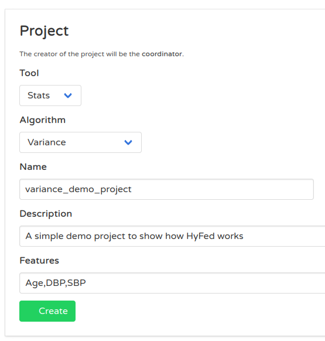

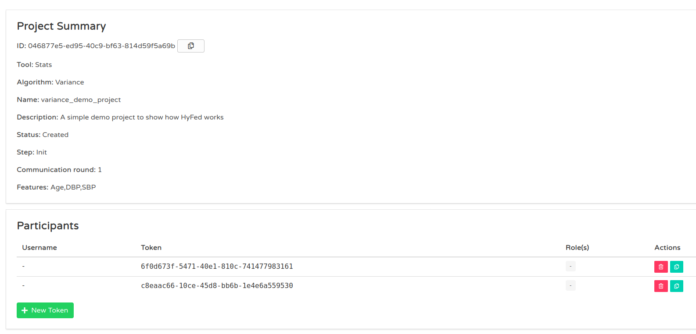

### Join project
The participants employ the client GUI to join the project, select the dataset, and see the status/progress of the project. Run two copies of the 
client GUI (one for each participant) as follows:
  ```
  source hyfed-client-venv/bin/activate
  cd hyfed/hyfed-client
  python stats_client_gui.py
  ```
For each participant, enter the username and password of the participant, ID of the project, and one of the tokens created by the coordinator. 
Notice that the project ID is the same but tokens are different for the participants.

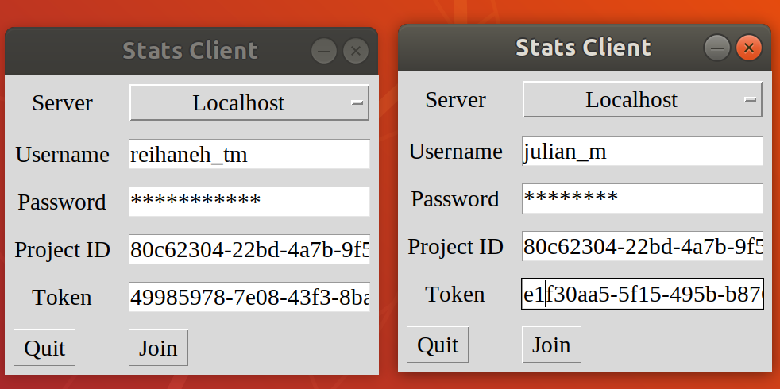

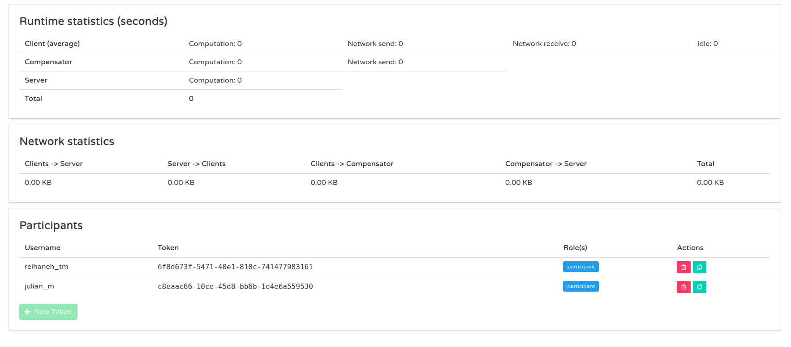


### Project info
If the join is successful, the project info widget appears and displays the project information obtained from the server. The participants should click on 
the 'Accept' button to proceed.

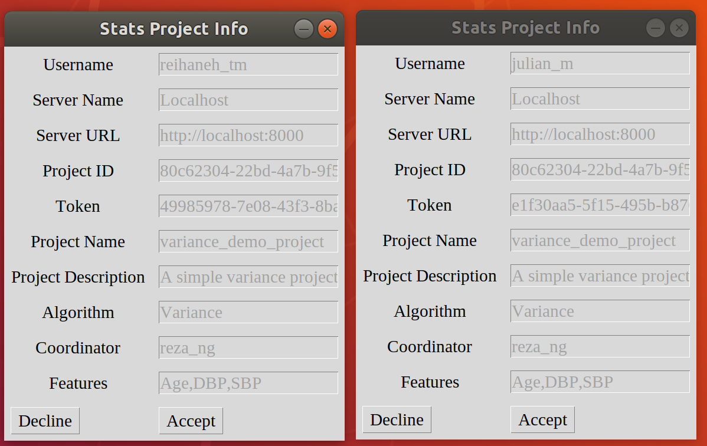

### Dataset selection
If the participant agrees to proceed, the dataset selection widget appears to enable the participant to select the dataset. There are two different dataset files, 
**stats_data_client1.csv** and **stats_data_client2.csv**, in the **hyfed-client/stats_client/sample_data/** directory. Both files have  'Age', 'DBP', and 'SBP' as 
the column names. The first/second participant selects the first/second dataset file and clicks on the 'Run' button.

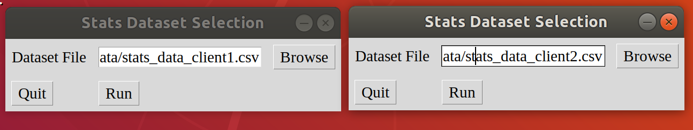

## Project status
If the participant clicks on the 'Run' button, the project starts running and the status/progress widget appears. The widget displays the current communication round, 
project status, project step, and client operation. The coordinator can see the progress of the project in the summary page or 'Projects' page. 
Here, the figures show the status of the project after it is completed , in which the project status is 'Done' and the project step is 'Finished'.
The participant can click on the 'Show log' button to view the communication between the client and server. Moreover, the complete list of the log messages is saved into a log file
 (identified by the project ID) in the **hyfed-client/stats_client/log/** directory.

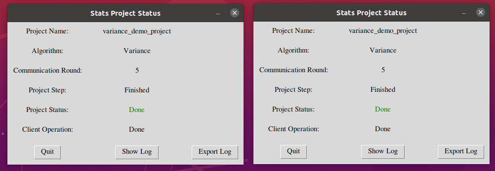

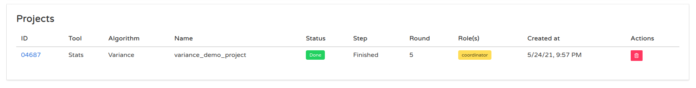

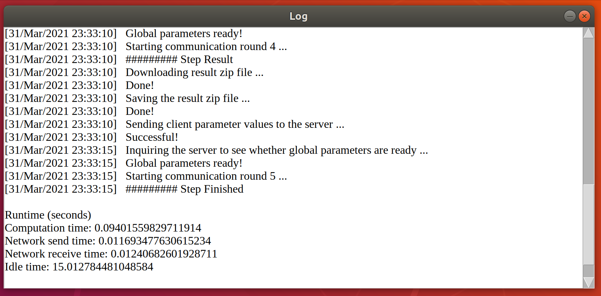

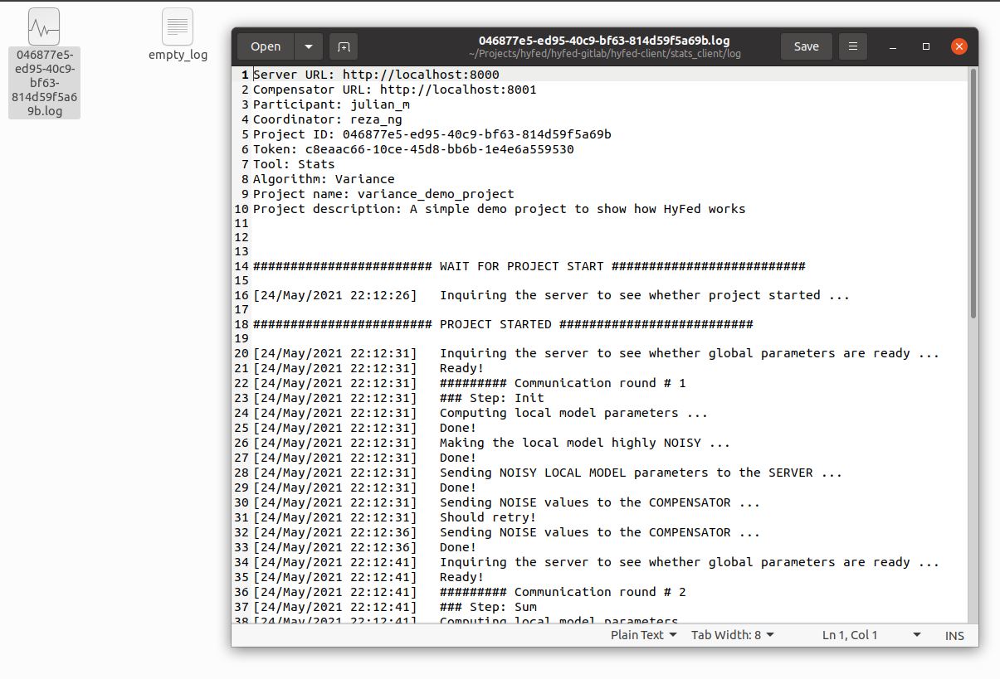


### View results
The coordinator can download the result zip file using the WebApp GUI. The participants can access the result file automatically downloaded by the client GUI into the 
**hyfed-client/stats_client/result/** directory. The result file is named according to the project ID.


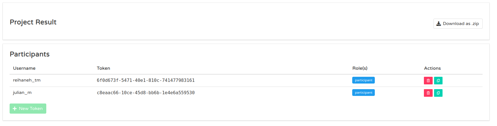

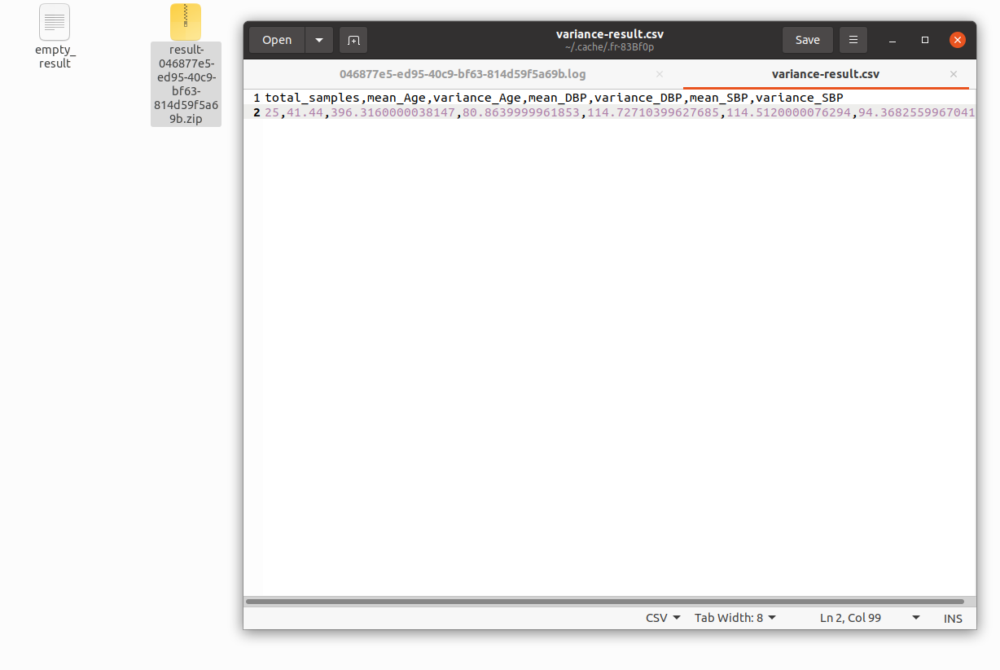

We successfully ran the Stats tool with the variance algorithm. The same procedure can be followed for a logistic regression project. The coordinator can set the value of the features, learning rate, and max iterations to
'Age,DBP,SBP' (without quotations), 0.001, and 500, respectively. The participants can use the same dataset files they did for the variance project.


